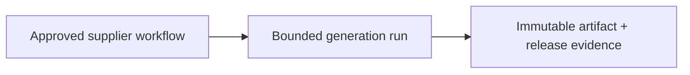
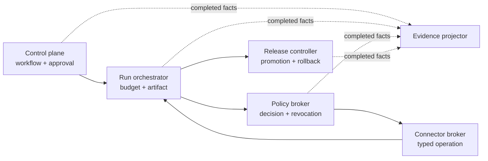

# Architecture: authority and evidence travel with the artifact

The central claim is that generated source is not the product. The product is a
workflow artifact whose behavior, authority, data access, release, and recovery can
be independently reviewed and revoked.

The smallest complete system has three responsibilities:



The control plane owns the approved intent. The run orchestrator consumes that
immutable digest and produces an immutable artifact. The release controller moves
that same digest between environments; it never rebuilds it.

## Why five services

The service boundaries are earned by different state, failure, scaling, and
security characteristics. They are not a service-per-noun catalogue.



The policy broker can fail closed without taking blueprint authoring offline. The
connector broker can rotate provider credentials without changing policy state. The
release controller can roll back a bad canary without mutating run history. The
evidence projector may lag or be rebuilt because it never authorizes a command.

## Code structure inside a service

Every process uses the same dependency direction:

```text
HTTP controller -> application use case -> domain rules -> repository/event ports
                                                      <- injected adapters
```

The controller validates a transport contract and derives tenant scope from the
authenticated request context. A use case coordinates one business decision. The
domain enforces state invariants. A composition root injects PostgreSQL,
EventBridge/SQS, clocks, IDs, policy, and provider adapters. Tests replace those
ports without changing the use case.

DRY applies to stable event envelopes, tracing, configuration validation, and test
mechanics. Domain entities and repositories remain local to the owning service.

## Distributed correctness

Database state and an outbox record commit together. A relay publishes the fact to
EventBridge. Each SQS subscriber claims the event's idempotency key in an inbox
before applying its business effect. A duplicate delivery therefore succeeds at
transport level but does not repeat the business action.

Ordering is aggregate-local, not global. Consumers compare expected versions and
reject or park gaps. Retries use bounded exponential backoff; exhausted messages go
to a dead-letter queue with replay tooling. A process manager records compensation
for cross-service workflows instead of pretending a distributed transaction exists.

## Code-to-reality card

| Field           | Runtime meaning                                                                                                               |
| --------------- | ----------------------------------------------------------------------------------------------------------------------------- |
| Declared intent | Terraform and task definitions describe networks, queues, databases, images, identities, limits and desired task counts       |
| Interpreter     | Terraform providers call AWS APIs; ECS reconciles task desired state; each Node.js process reads validated configuration      |
| Software effect | AWS resources, ECS services, database schemas, queue subscriptions and immutable image bindings change                        |
| Hardware effect | Fargate allocates CPU/memory/network; RDS uses compute/disk; SQS/EventBridge consume network and retained storage             |
| Evidence        | Terraform plan, ECS deployment events, health/readiness, traces, queue age, DB migrations, canary probes and rollback receipt |

## Failure exercise

The tracer deliberately delivers one event twice, submits one cross-tenant request,
revokes one capability, and fails one canary. It must prove one business effect,
neutral denial, revocation convergence, restoration of the previous artifact digest,
and continuous correlation IDs. Happy-path output alone is not acceptance evidence.
